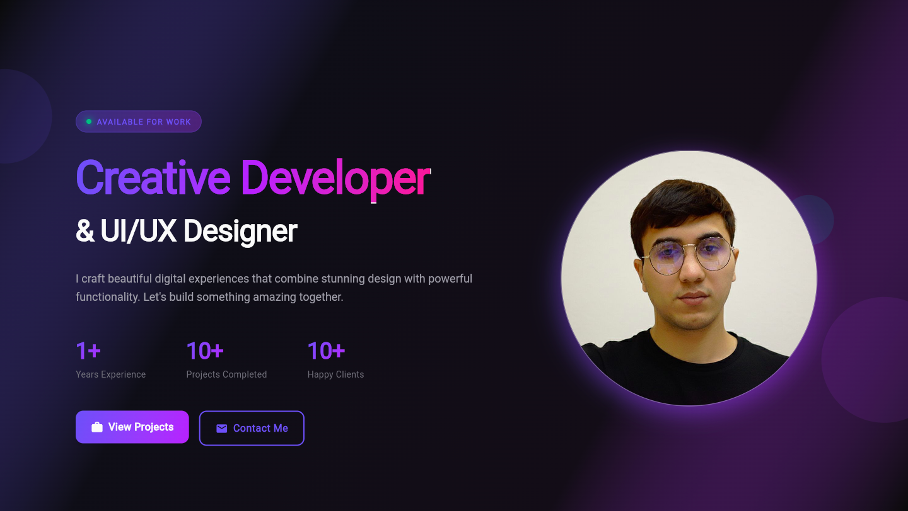

# 🚀 Modern Portfolio App

A modern portfolio application built with Flutter featuring beautiful animations and responsive design.

## ✨ Features

- 🎨 **Modern Design** - Glassmorphism, gradients, and smooth animations
- 📱 **Responsive** - Separate UI for mobile, tablet, and desktop
- 🎭 **Animations** - Appear, Hover Tilt, Scale and other effects
- 🌈 **Gradients & Glow** - Modern visual effects
- 📊 **Sections** - Home, Skills, Projects, Contacts
- 🔄 **Smooth Navigation** - Seamless scrolling between sections

## 📁 Project Structure

```
lib/
├── main.dart                      # Entry point
├── app.dart                       # App configuration
├── bootstrap.dart                 # Initialization
├── core/
│   ├── theme/                     # Colors, typography, shadows
│   │   ├── colors.dart
│   │   ├── typography.dart
│   │   ├── spacing.dart
│   │   └── shadows.dart
│   └── animation/                 # Animations
│       ├── appear.dart
│       └── hover_tilt.dart
├── features/
│   ├── home/                      # Home page
│   │   ├── home_page.dart
│   │   └── home_view.dart
│   ├── skills/                    # Skills
│   │   ├── skills_page.dart
│   │   └── skill_chip.dart
│   ├── projects/                  # Projects
│   │   ├── projects_page.dart
│   │   ├── projects_card.dart
│   │   └── projects_model.dart
│   └── contacts/                  # Contacts
│       ├── contacts_page.dart
│       └── social_links.dart
└── shared/
    ├── layout/                    # Responsive layout
    │   └── responsive_layout.dart
    └── widgets/                   # Common widgets
        ├── glass_container.dart
        ├── primary_button.dart
        └── section_layout.dart
```

## 🚀 Getting Started

### Prerequisites
- Flutter SDK (>=3.0.0)
- Dart SDK
- IDE (VS Code, Android Studio, or IntelliJ)

### Installation

1. **Clone the repository**
```bash
git clone <your-repo-url>
cd portfolio
```

2. **Install dependencies**
```bash
flutter pub get
```

3. **Add your images**
   
   Place your images in the `assets/` folder:
   - `profile.jpg` - Your profile photo
   - `project1.jpg` - Project 1 image
   - `project2.jpg` - Project 2 image
   - `project3.jpg` - Project 3 image
   - `project4.jpg` - Project 4 image

4. **Run the app**

   For Web:
   ```bash
   flutter run -d chrome
   ```

   For iOS:
   ```bash
   flutter run -d ios
   ```

   For Android:
   ```bash
   flutter run -d android
   ```

   For Desktop:
   ```bash
   flutter run -d macos  # or windows, linux
   ```

## 🎨 Customization

### Change colors
Open `lib/core/theme/colors.dart` and change colors to match your brand:

```dart
static const Color primary = Color(0xFF6366F1);  // Your primary color
static const Color accent = Color(0xFFA855F7);   // Accent color
```

### Add your projects
Open `lib/features/projects/projects_page.dart` and modify the `_projects` list:

```dart
Project(
  title: 'Your Project Name',
  description: 'Project description...',
  imageUrl: 'assets/your_image.jpg',
  tags: ['Flutter', 'Firebase'],
  category: ProjectCategory.mobile,
  color: Color(0xFF6366F1),
),
```

### Update contact information
Open `lib/features/contacts/contacts_page.dart` and change:

```dart
_buildInfoCard(
  icon: Icons.email_rounded,
  title: 'Email',
  value: 'zuhurovhabibullo@yahoo.com',  // Your email
  color: AppColors.primary,
),
```

### Add social media links
Open `lib/features/contacts/social_links.dart` and add/modify links:

```dart
SocialLink(
  name: 'GitHub',
  icon: Icons.code_rounded,
  url: 'https://github.com/Habibullo155/',  // Your link
  color: Color(0xFF6366F1),
),
```

## 📱 Responsive Design

The app automatically adapts to different screen sizes:

- **Mobile** (< 768px) - Vertical layout, side drawer menu
- **Tablet** (768px - 1024px) - Mixed layout
- **Desktop** (> 1024px) - Horizontal layout, floating navigation

## 🎭 Animations

- **AppearAnimation** - Fade and slide in effect
- **HoverTilt** - 3D tilt on hover
- **HoverLift** - Element lift on hover
- **MagneticHover** - Magnetic attraction effect
- **ScaleAppearAnimation** - Scale in animation

## 🔧 Useful Commands

```bash
# Run in debug mode
flutter run

# Build release version
flutter build apk          # Android
flutter build ios          # iOS
flutter build web          # Web
flutter build macos        # macOS

# Clean cache
flutter clean

# Update dependencies
flutter pub upgrade
```

## 🎯 Breakpoints

- Mobile: < 768px
- Tablet: 768px - 1024px
- Desktop: > 1024px
- Wide: > 1280px

## 🏗️ Architecture

The project follows a feature-first structure:
- `core/` - Theme, animations, utilities
- `features/` - Feature modules (home, skills, projects, contacts)
- `shared/` - Shared widgets and layouts

## 🎨 Design System

**Colors:**
- Primary: Indigo (#6366F1)
- Accent: Purple (#A855F7)
- Background: Dark (#0A0A0A)
- Surface: Dark Gray (#151515)

**Typography:**
- Display: 48-72px (Hero sections)
- Headings: 18-36px
- Body: 14-18px
- Captions: 12-14px

**Spacing:**
- Based on 8px grid system
- Section padding: 48-80px vertical
- Card gap: 16-24px

## 📦 Dependencies

```yaml
dependencies:
  flutter:
    sdk: flutter
  cupertino_icons: ^1.0.6
```

## 🌐 Deployment

### Web
```bash
flutter build web --release
```
Deploy the `build/web` folder to your hosting service.

### Mobile
```bash
flutter build apk --release  # Android
flutter build ios --release  # iOS
```

## 📝 License

MIT License - Feel free to use for your projects!

## 🤝 Contact

If you have any questions, reach out to me:
- Email: zuhurovhabibullo@yahoo.com
- GitHub: [@Habibullo155](https://github.com/Habibullo155)
- LinkedIn: [Habibullo](https://www.linkedin.com/in/habibullo-zukhurov-921154394)

## 🙏 Acknowledgments

- Flutter team for the amazing framework
- Community for inspiration and support

---

Made with ❤️ using Flutter

## 📸 Screenshots

### Desktop


### Mobile


---

⭐ If you like this project, please give it a star on GitHub!